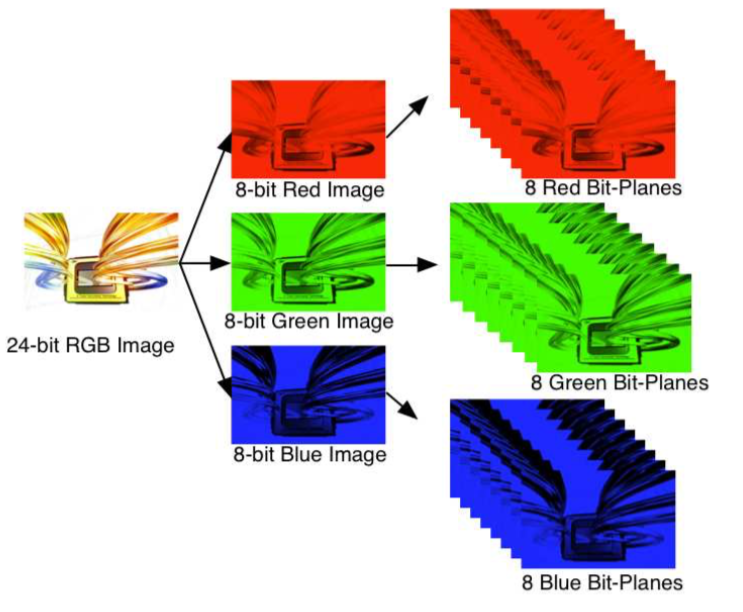
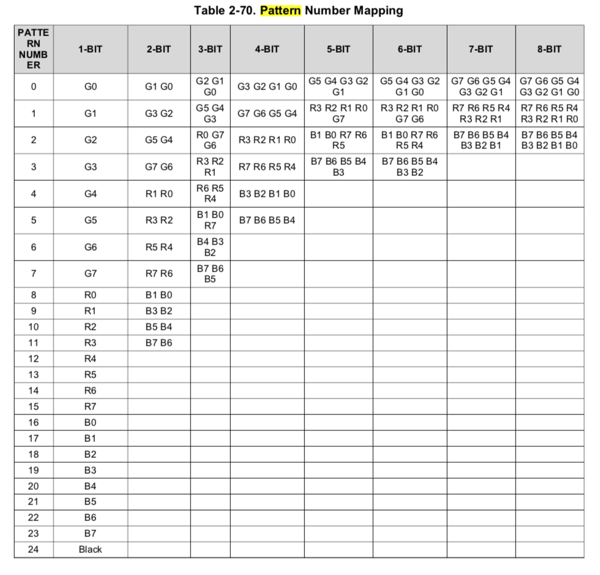

## Create 24-bit RGB from 1-bit pattern images

Code for creating the 24 bit depth RGB bmp files from 1-bit pattern images stored as individual bmp files.

The 1-bit pattern images were generated and stored in a folder:
 
	input_pattern_images/
	 ├── bitPlane_00.bmp
	 ├── bitPlane_01.bmp
	 ├── bitPlane_02.bmp
	 ├── bitPlane_03.bmp
	 ├── bitPlane_04.bmp
	 ├── bitPlane_05.bmp
	 ├── bitPlane_06.bmp
	 ├── bitPlane_07.bmp
	 ├── bitPlane_08.bmp
	 └── bitPlane_09.bmp

The ``createRGBPatternImage`` function is called with the ``basename`` for the images and the folder ``path``.

The pattern images are stored in the RGB image with the following order:

	G0, G1, ..., G7, R0, ..., R7, B0, ..., B7

The order and the flash index are indicated in the ``out_rgb_order.txt`` file as:

	## Flash index 0 ##
	G0 <- 	 bitPlane_00.bmp  
	G1 <- 	 bitPlane_01.bmp  
	G2 <- 	 bitPlane_02.bmp  
	G3 <- 	 bitPlane_03.bmp  
	G4 <- 	 bitPlane_04.bmp  
	G5 <- 	 bitPlane_05.bmp  
	G6 <- 	 bitPlane_06.bmp  
	G7 <- 	 bitPlane_07.bmp  
	R0 <- 	 bitPlane_08.bmp 
	R1 <- 	 bitPlane_09.bmp 

The output images are stored as ``rgb_im`` and by default it are written to
``out1.bmp, out2.bmp, ...``
